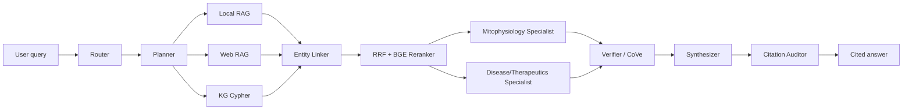

# MitoRAG

Ask any question about mitochondria. Get cited, KG-grounded answers.

MitoRAG is a local-first mitochondrial research assistant with PDF ingestion,
hybrid retrieval, a Neo4j knowledge graph, 12-agent orchestration, scientific
web search, Auto-KG construction, and a 3D web explorer.

## Quick Start

```bash
cp .env.example .env
docker compose up --build
open http://localhost:3000
mitorag ask "How does Complex I contribute to ROS generation?"
```

Drop PDFs into `data/papers/` or use the Paper Library upload zone. The watcher
parses papers, chunks evidence, indexes retrieval stores, extracts triples, and
updates the KG with provenance.

## Architecture



## Web UI

- Chat page: streaming answer, clickable `[PMID:xxxxx]` and `[doi:...]`
  citations, contradiction badges, and a collapsible 12-agent latency trace.
- 3D KG Explorer: force-directed molecular graph with node colors by type,
  search/center, filters, level selector, edge evidence, and red controversy
  highlighting.
- Paper Library: ingested paper list, drag-and-drop PDF upload, per-paper
  entities/triples/status, and local corpus search.
- Dashboard: KG statistics, agent latency, recent queries, performance targets,
  and ingestion log.

## 10 KG Levels

1. Whole mitochondrion: OMM, IMM, IMS, matrix, localization edges.
2. OXPHOS / ETC: Complex I-V, CoQ10, cytochrome c, electron/proton flow.
3. TCA cycle: citrate synthase through malate dehydrogenase.
4. Fatty acid beta-oxidation: CPT1/CPT2 to acetyl-CoA.
5. Dynamics: MFN1/2, OPA1, DRP1/FIS1/MFF, PINK1/Parkin, PGC-1alpha/TFAM.
6. Import: TOM, TIM23, TIM22, SAM, MIA40/Erv1, MCU.
7. Apoptosis: BCL-2 family, MOMP, cytochrome c, caspase-9, mPTP controversy.
8. Diseases: MELAS, LHON, Leigh, MERRF, NARP with variants and genes.
9. Signaling: UPRmt, ROS, NF-kB/HIF-1alpha/Nrf2, FGF21, GDF15, ISR.
10. Therapeutics: Idebenone, CoQ10, MitoQ, Elamipretide, Urolithin A, NMN, NR.

## Supported APIs

- PubMed E-utilities
- Semantic Scholar Academic Graph
- Europe PMC
- bioRxiv/medRxiv
- PubTator3 annotations
- CrossRef/Unpaywall-ready package boundaries

## CLI

```bash
mitorag ask "How does Complex I contribute to ROS generation?"
mitorag ask "What drugs target mitophagy?" --deep
mitorag ingest ./new_papers/
mitorag kg stats
mitorag kg query "MATCH (g:Gene)-[:CAUSES]->(d:Disease) RETURN g,d LIMIT 10"
mitorag kg level 2
mitorag search "PINK1 Parkin mitophagy"
mitorag contradictions
```

## Performance Targets

- Query to answer: 30-120s on 32GB / 12-core CPU.
- PDF ingestion: under 30s per paper.
- KG query: under 1s for simple Cypher.
- Hybrid retrieval: under 2s over 10K chunks.
- Fan-out internet search: under 5s with parallel async clients.

## Model Requirements

32GB RAM is recommended. 16GB works with the fallback reasoning model.

| Component | 32GB profile |
| --- | ---: |
| qwen2.5:14b Q4_K_M | ~9 GB |
| llama3.2:3b Q4_K_M | ~2 GB |
| Ollama overhead | ~2 GB |
| Neo4j | ~4 GB |
| ChromaDB | ~2 GB |
| Python + API | ~4 GB |
| OS | ~8 GB |
| Total | ~31 GB |

For 16GB machines, set:

```env
MODEL_REASONING=qwen2.5:7b-instruct-q4_K_M
```

Expect roughly a 10% reasoning quality drop, but the stack fits without swap.

## Screenshot Gallery

- Chat: cited response with agent trace and contradiction badge.
- KG Explorer: 3D OXPHOS subgraph centered on Complex I-V.
- Paper Library: drag-and-drop PDF ingestion and Auto-KG status.
- Dashboard: KG stats above agent latency and ingestion log.

## Development

```bash
python -m venv .venv
. .venv/bin/activate
python -m pip install -U pip
python -m pip install -e "packages/ingestion[dev]" -e "packages/retrieval[dev]" -e "packages/knowledge_graph[dev]" -e "packages/internet[dev]" -e "packages/agents[dev]" -e "apps/api[dev]" -e "apps/cli[dev]"
ruff check .
pyright
pytest
```

Frontend:

```bash
cd packages/ui
npm install
npm run dev
```

Smoke tests:

```bash
python scripts/ollama_smoke.py
python scripts/retrieval_smoke.py
python scripts/agents_smoke.py "How many subunits does Complex I have?"
python scripts/web_search_smoke.py "Complex I cryo-EM"
python scripts/auto_kg_smoke.py
```
